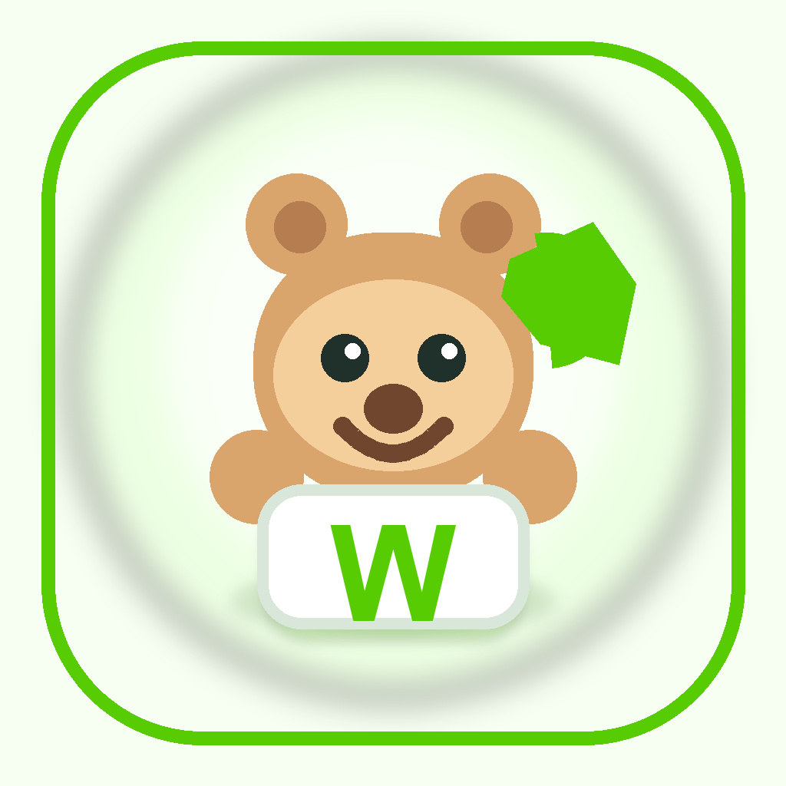

<p align="center">
  
</p>

# Wordibara

Wordibara is a local-first English vocabulary learning app for kids. It uses short practice sessions, Chinese prompts, cute avatars, and simple game loops to help learners review English words offline.

The project is currently an early v1 Expo app. It has local profiles, word-scope selection, two vocabulary games, wrong-word review, collection/settings screens, and committed generated word packs.

## Features

- Local learner profiles with avatar and display name only
- 600-scope and 1500-scope word packs
- Chinese-to-English typing game
- Word-pattern letter game
- Wrong-word logging and review flow
- Offline local persistence with SQLite on native platforms
- Web preview fallback using browser local storage
- No backend, login, ads, analytics, microphone, or child profile upload in v1

## Quick Start

Install dependencies:

```sh
npm install
```

Run the Expo dev server:

```sh
npm run mobile
```

Run the web preview:

```sh
npm run mobile:web
```

Run on Android:

```sh
make android
```

`make android` uses Expo Go. If your shell has `EXPO_OFFLINE=1`, the wrapper clears it for this target; use `make android-dev` for a native debug build instead.

Install a local Android release build:

```sh
make android-release
make android-launch
```

More setup and device notes are in [Development](docs/development.md).

## Project Layout

```txt
apps/mobile/                    Expo React Native app
packages/content/word-packs/    Generated JSON vocabulary packs
packages/content/source/        Supplemental content source data
scripts/                        Content and local environment helpers
docs/                           Product, data, privacy, and setup docs
```

## Documentation

- [Docs index](docs/README.md)
- [Development setup](docs/development.md)
- [Product spec](docs/product-spec.md)
- [Database schema](docs/database-schema.md)
- [Wireframes](docs/wireframes.md)
- [Privacy notes](docs/privacy.md)
- [Word-pack data](packages/content/word-packs/README.md)
- [Agent guide](AGENTS.md)

## Word Packs

Runtime content comes from generated JSON files committed under `packages/content/word-packs/`.

Current packs:

- `en-600`: 685 entries generated from `en-600.pdf`
- `en-1500`: 1500 entries generated from `en-1500.xls`

Raw source files are not committed. To regenerate the JSON packs, place `en-600.pdf` and `en-1500.xls` at the repo root locally, then run:

```sh
npm run extract:words
```

Important: verify redistribution rights for vocabulary source material before publishing or redistributing derived content.

## Contributing

Contributions are welcome while the app is still early. Start with [CONTRIBUTING.md](CONTRIBUTING.md), and keep privacy constraints in mind: no child tracking, no ads, no backend child profiles, and no external analytics in v1.

## License

Code is licensed under the [Apache License 2.0](LICENSE). Vocabulary/source data may have separate provenance and redistribution requirements; see the word-pack docs before reusing content.
